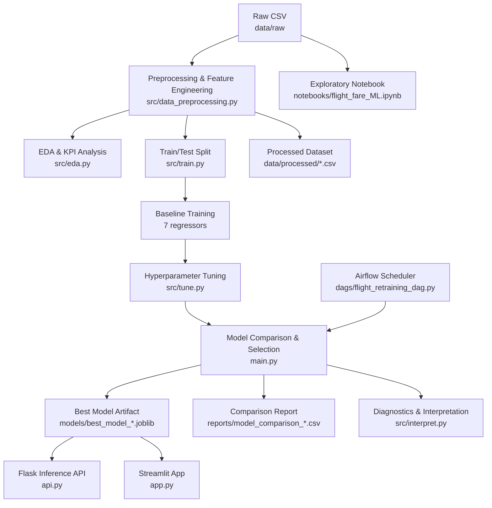
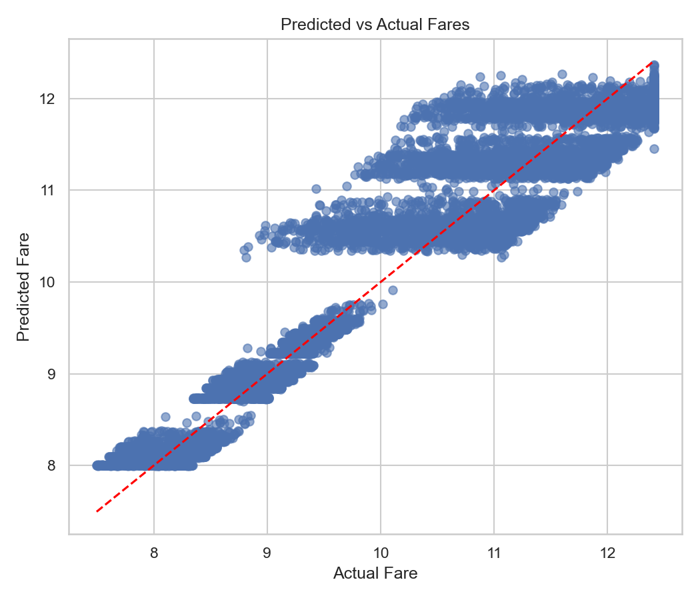

# Flight Fare Prediction Pipeline

[](https://www.python.org/)
[](LICENSE)
[](https://flask.palletsprojects.com/)
[](https://streamlit.io/)
[](https://airflow.apache.org/)

## The Story

In the rapidly evolving aviation market of Bangladesh, pricing is no longer just about distance. It's a complex interplay of seasonal demand, lead times, and carrier positioning. This project was born from the need to understand these dynamics and provide a robust, automated way to predict ticket costs.

By processing over 57,000 flight records, we've built an end-to-end pipeline that handles everything from raw data cleaning to real-time inference. Whether it's the premium service of Biman Bangladesh Airlines or the budget-friendly routes of newer carriers, our model captures the nuances of the local market.

### Objective
To develop a production-ready machine learning solution for estimating flight ticket prices, helping airlines optimize revenue and allowing travelers to make informed booking decisions based on historical trends.


### Key Capabilities
- **Advanced Preprocessing:** Handles IQR winsorization, log-transformations, and automated feature engineering.
- **Multi-Model Evaluation:** Baseline training across 7 different regressors to find the optimal fit.
- **Automated Tuning:** Uses GridSearchCV and RandomizedSearchCV for hyperparameter optimization.
- **Production Ready:** Includes a Flask REST API and a Streamlit dashboard for interaction.
- **Scheduled Retraining:** Integrated with Apache Airflow for weekly model updates.


---

## Project Structure

```text
DEM09/
├── main.py                       # Pipeline entry point (run from here)
├── api.py                        # Flask prediction API
├── app.py                        # Streamlit UI
├── requirements.txt
├── dags/
│   └── flight_retraining_dag.py  # Airflow DAG (weekly schedule)
├── notebooks/
│   └── flight_fare_ML.ipynb      # Exploratory notebook (source of truth for design)
├── data/
│   ├── raw/
│   │   └── Flight_Price_Dataset_of_Bangladesh.csv
│   └── processed/                # Timestamped CSVs written on each run
├── models/                       # Timestamped .joblib artifacts
├── reports/
│   ├── figures/                  # EDA and diagnostic plots
│   └── model_comparison_*.csv    # Per-run metrics table
└── src/
    ├── __init__.py
    ├── config.py                 # Paths, feature lists, hyperparameters
    ├── data_preprocessing.py     # Full preprocessing pipeline
    ├── eda.py                    # EDA summaries and visualizations
    ├── train.py                  # Baseline model training
    ├── tune.py                   # Hyperparameter tuning
    ├── interpret.py              # Feature importance and diagnostics
    ├── pipeline_tasks.py         # Airflow-callable task wrappers
    └── main.py                   # Shim — delegates to root main.py
```

---

## Pipeline Architecture



### Stage-by-Stage Responsibilities

| # | Stage | Module |
|---|---|---|
| 1 | Normalize columns, coerce types, reconstruct missing fares | [src/data_preprocessing.py](src/data_preprocessing.py) |
| 2 | Impute, remove negatives, IQR-cap outliers, drop duplicates | [src/data_preprocessing.py](src/data_preprocessing.py) |
| 3 | Engineer `month`, `departure_period`, `weekday`; apply `log1p` to target | [src/data_preprocessing.py](src/data_preprocessing.py) |
| 4 | EDA summaries, KPIs, correlation heatmap, distribution plots | [src/eda.py](src/eda.py) |
| 5 | Baseline training 7 models with separate linear / tree preprocessors | [src/train.py](src/train.py) |
| 6 | Tuning Ridge/Lasso (GridSearch), RandomForest/GradientBoosting (RandomizedSearch) | [src/tune.py](src/tune.py) |
| 7 | Compare all models by RMSE, save best artifact with run timestamp | [main.py](main.py) |
| 8 | Feature importance plots, actual-vs-predicted, residuals | [src/interpret.py](src/interpret.py) |
| 9 | Serve predictions via REST API and Streamlit UI | [api.py](api.py), [app.py](app.py) |
| 10 | Weekly automated retraining via Airflow | [dags/flight_retraining_dag.py](dags/flight_retraining_dag.py) |

---

## Visual Insights & Performance

Our analysis revealed significant patterns in how flight prices are determined in Bangladesh.

### Data Distribution & Monthly Trends
Fares show a heavy right-skew, which we managed using log-transformations. Seasonality is a major driver, with peaks during summer (June-August) and winter (December-January) holidays.

| Fare Distribution | Monthly Price Trends |
|---|---|
|  |  |

### Model Performance
The **Gradient Boosting Regressor** emerged as our champion model, achieving an **R² of 0.8977**. It captures non-linear interactions between airlines and lead times far more effectively than simpler linear models.

| Predicted vs Actual | Feature Importance |
|---|---|
|  |  |

> [!NOTE]
> The primary drivers of ticket prices are **Airline**, **Travel Class**, and **Destination**. Early booking discounts are significant, while mid-week flights offer slight savings.

---

## Feature Set


| Type | Features |
|---|---|
| **Categorical** (8) | `airline`, `source_name`, `destination_name`, `class`, `seasonality`, `weekday`, `departure_period`, `booking_source` |
| **Numeric** (4) | `duration_hrs`, `stopovers`, `days_before_departure`, `month` |
| **Target** | `total_fare_log` = `np.log1p(total_fare_bdt)` → inverse: `np.expm1(prediction)` |

---

## Tech Stack

- **Python 3.10+**
- pandas, numpy, scikit-learn, joblib
- matplotlib, seaborn, plotly
- Flask + gunicorn (REST API)
- Streamlit (interactive UI)
- Apache Airflow (scheduled retraining)

---

## Quick Start

Ensure you have **Python 3.10+** installed.

### 1. Clone & Initialize
```bash
git clone https://github.com/DE-E-K/DEM09.git
cd DEM09
```

### 2. Virtual Environment Setup

| Platform | Command |
|---|---|
| **Windows (PS)** | `python -m venv .venv; .\.venv\Scripts\Activate.ps1` |
| **Windows (CMD)** | `python -m venv .venv && .venv\Scripts\activate.bat` |
| **Linux / macOS** | `python3 -m venv .venv && source .venv/bin/activate` |

### 3. Install Requirements
```bash
pip install -r requirements.txt
```

---

## Running the Pipeline

To execute the full data processing, training, and report generation cycle:

```bash
python main.py --run-all
```

> [!TIP]
> Use `--data-path` to specify a custom dataset if you aren't using the default one in `data/raw/`.


Optional — specify a custom dataset path:

```bash
python main.py --run-all --data-path "data/raw/Flight_Price_Dataset_of_Bangladesh.csv"
```

Legacy / Airflow style (still works via redirect shim):

```bash
python -m src.main --run-all
```

Pipeline outputs are saved under:

| Path | Contents |
|---|---|
| `data/processed/flight_fares_processed_<timestamp>.csv` | Cleaned feature set |
| `models/best_model_<timestamp>.joblib` | Best fitted pipeline |
| `reports/model_comparison_<timestamp>.csv` | All model metrics |
| [reports/figures/](reports/figures/) | EDA and diagnostic plots |

> Artifact paths in [src/config.py](src/config.py) always resolve to the **newest** timestamped file automatically. Override with env vars (`BEST_MODEL_LATEST_JOBLIB`, etc.) for container deployments.

---

## Run the Flask API

**Development:**
```bash
python api.py
```

**Production (gunicorn):**
```bash
gunicorn -w 4 api:app
```

API runs on `http://127.0.0.1:5000`.

### Endpoints

| Method | Path | Description |
|---|---|---|
| `GET` | `/health` | Liveness check + model load status |
| `POST` | `/predict` | Predict fare from JSON payload |

### Sample Request

```bash
curl -X POST http://127.0.0.1:5000/predict \
     -H "Content-Type: application/json" \
     -d '{
          "airline": "Biman Bangladesh Airlines",
          "source_name": "Hazrat Shahjalal International Airport",
          "destination_name": "Shah Amanat International Airport",
          "class": "Economy",
          "seasonality": "Regular",
          "weekday": "Wednesday",
          "departure_period": "Morning",
          "duration_hrs": 1.2,
          "stopovers": 0,
          "days_before_departure": 14,
          "month": 6
         }'
```

### Sample Response
```json
{
  "prediction_bdt": [4823.17],
  "status": "success",
  "model_version": "20240227"
}
```

---

## Run the Streamlit App

```bash
streamlit run app.py
```

Open the URL shown in the terminal (usually `http://localhost:8501`).


The app populates all dropdown options from the processed dataset automatically.

---

## Airflow Retraining DAG

DAG file: [dags/flight_retraining_dag.py](dags/flight_retraining_dag.py)

| Property | Value |
|---|---|
| DAG ID | `flight_fare_retraining` |
| Schedule | Monthly (`@monthly` — 1st of each month, midnight) |
| Tasks | `check_data_availability` → `retrain_model` → `notify_success` |
| Retrain command | `python -m src.main --run-all` |

---

## Troubleshooting

| Symptom | Fix |
|---|---|
| `Model or processed data not found` | Run `python main.py --run-all` first |
| `API returns 503 "Model not loaded"` | Verify files exist in `models/` and paths resolve in `src/config.py` |
| `ImportError` or `ModuleNotFoundError` | Ensure the virtual env is active and run commands from the project root |
| Predictions look wrong after retraining | [app.py](app.py) / [api.py](api.py) use `st.cache_resource` — restart the server to reload the new model |

---

## License

This project is licensed under the terms in [LICENSE](LICENSE).

