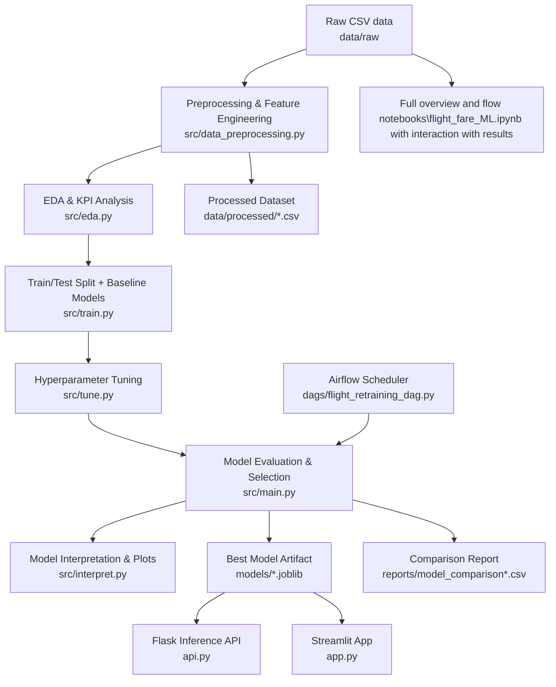

# Flight Fare Prediction Pipeline

End-to-end machine learning project for predicting flight fares in Bangladesh. The repository includes:

- Data preprocessing and feature engineering
- Exploratory data analysis (EDA)
- Baseline training and hyperparameter tuning
- Model interpretation and reporting
- A Flask API for inference
- A Streamlit app for interactive predictions
- An Airflow DAG for scheduled retraining

## Project Structure

```text
DEM09/
├── api.py                        # Flask prediction API
├── app.py                        # Streamlit UI
├── inspect_model.py              # Utility to inspect saved model features/steps
├── test_api.py                   # Simple API request script
├── requirements.txt
├── dags/
│   └── flight_retraining_dag.py  # Airflow DAG (yearly schedule)
├── notebook
├── data/
│   ├── raw/
│   └── processed/
├── models/
├── reports/
│   └── figures/
└── src/
      ├── config.py
      ├── data_preprocessing.py
      ├── eda.py
      ├── train.py
      ├── tune.py
      ├── interpret.py
      └── main.py                   # Pipeline entry point
```

## Pipeline Architecture

The project follows an orchestrated ML pipeline where each stage is implemented in a focused module and coordinated by `src/main.py`.



### Stage-by-Stage Responsibilities

1. **Ingest & preprocess**: load raw flight data, normalize schema, clean values, and engineer time/route features.
2. **Analyze**: produce EDA summaries and visual diagnostics for fare behavior.
3. **Train baseline models**: benchmark multiple regressors on the prepared feature set.
4. **Tune candidate models**: optimize hyperparameters with cross-validation.
5. **Select and persist best model**: compare by regression metrics and save best artifact.
6. **Interpret and report**: generate diagnostics/plots and model comparison report.
7. **Serve predictions**: expose model via Flask API and Streamlit UI.
8. **Retrain on schedule**: Airflow triggers recurring pipeline runs.

## Tech Stack

- Python 3.10+
- pandas, numpy, scikit-learn
- matplotlib, seaborn
- Flask (API)
- Streamlit (UI)
- Apache Airflow (scheduling)

## Quick Start

### 1) Clone and move into the project

```bash
git clone https://github.com/DE-E-K/DEM09.git
cd DEM09
```

### 2) Create a virtual environment

**Windows (PowerShell):**

```powershell
python -m venv .venv
.\.venv\Scripts\Activate.ps1
```

**Windows (CMD):**

```cmd
python -m venv .venv
.venv\Scripts\activate.bat
```

### 3) Install dependencies

```bash
pip install -r requirements.txt
```

## Run the ML Pipeline

Run the full preprocessing + training + tuning flow:

```bash
python -m src.main --run-all
```

Optional: run with a custom dataset path:

```bash
python -m src.main --run-all --data-path "data/raw/Flight_Price_Dataset_of_Bangladesh.csv"
```

Pipeline outputs are saved under:

- `data/processed/`
- `models/`
- `reports/`
- `reports/figures/`

## Run the API (Flask)

Start the prediction API:

```bash
python api.py
```

API runs on `http://127.0.0.1:5000`.

### Endpoints

- `GET /health` — service status and model load state
- `POST /predict` — fare prediction

### Sample Request

```json
{
   "airline": "Malaysian Airlines",
   "source_name": "Cox's Bazar Airport",
   "destination_name": "Netaji Subhas Chandra Bose International Airport, Kolkata",
   "date": "2025-12-12",
   "stopovers": "Direct",
   "class": "Economy",
   "departure_period": "Morning",
   "duration_hrs": 1.2
}
```

Quick API test:

```bash
python test_api.py
```

## Run the Streamlit App

```bash
streamlit run app.py
```

Then open the local URL shown in the terminal (usually `http://localhost:8501`).
overview


## Airflow Retraining DAG

Airflow DAG file: `dags/flight_retraining_dag.py`

- DAG ID: `flight_fare_retraining`
- Current schedule: yearly (`timedelta(year=yearly)`)
- Main task executes:

```bash
python -m src.main --run-all
```

> Note: The DAG currently uses a hardcoded project path (`/opt/airflow/dags/repo`). Update it to match your Airflow volume mount.

## Model Inspection Utility

To inspect saved model structure and expected features:

```bash
python inspect_model.py
```

## Troubleshooting

- **Model or processed data not found**: run `python -m src.main --run-all` first.
- **API returns "Model not loaded"**: verify files in `models/` and paths in `src/config.py`.
- **Import/module errors**: ensure your virtual environment is active and dependencies are installed.

## License

This project is licensed under the terms in [LICENSE](LICENSE).
