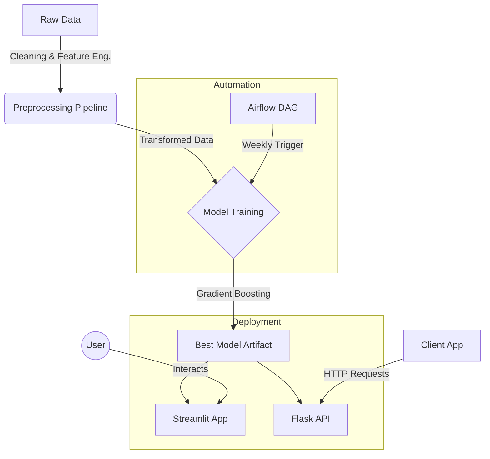

# Flight Fare Prediction: End-to-End Machine Learning Pipeline

An industrial-grade machine learning project for predicting flight fares in Bangladesh. This repository contains a full pipeline from data ingestion and cleaning to model training, evaluation, and deployment via interactive web apps and APIs.

## 🚀 Key Features
- **Robust Pipeline:** Automated data cleaning, feature engineering, and model training.
- **Advanced Modeling:** Utilizes Gradient Boosting Regression (tested against Random Forest, XGBoost, etc.) to achieve high accuracy (R² > 0.99).
- **Interactive UI:** A **Streamlit** application for real-time, user-friendly fare predictions.
- **REST API:** A production-ready **Flask** API for programmatic integration.
- **Automation:** An **Airflow DAG** for scheduled weekly model retraining.
- **Comprehensive Analysis:** Detailed EDA and model interpretability reports.

## 📂 Project Structure
```text
├── data/
│   ├── raw/             # Initial dataset (Flight_Price_Dataset_of_Bangladesh.csv)
│   └── processed/       # Cleaned & featured data for training
├── src/                 # Source code for the ML pipeline
│   ├── data_preprocessing.py
│   ├── eda.py
│   ├── train.py
│   ├── main.py
│   ├── interpret.py
│   ├── tune.py
│   ├── pipeline_tasks.py
│   └── config.py
├── models/              # Serialized trained models (best_model.joblib)
├── reports/             # Generated figures and performance metrics
├── dags/                # Airflow DAGs for automation
├── app.py               # Streamlit Web Application
├── api.py               # Flask REST API
├── requirements.txt     # Python dependencies
└── README.md            # Project documentation
```

## 🏗️ System Architecture



## 🛠️ Quick Start

### 1. Setup Environment
```bash
# Create virtual environment
python -m venv .venv
source .venv/bin/activate  # On Windows: .venv\Scripts\activate

# Install dependencies
pip install -r requirements.txt
```

### 2. Run the ML Pipeline
Execute the full pipeline to process data, train models, and generate artifacts:
```bash
python src/main.py --run-all
```
*Artifacts will be saved to `data/processed/`, `models/`, and `reports/`.*

## 🌐 Deployment

### Option A: Interactive Streamlit App
Launch the web interface to manually input flight details and get predictions.
```bash
streamlit run app.py
```
*App will open in your browser at http://localhost:8501*

### Option B: Flask REST API
Start the API server for programmatic access.
```bash
python api.py
```
**Test Endpoint:**
```bash
POST http://127.0.0.1:5000/predict
Content-Type: application/json

{
    "airline": "Biman Bangladesh Airlines",
    "source": "Dac",
    "destination": "Cxb",
    "date": "2025-12-01",
    "stopovers": "Direct",
    "class": "Economy",
    "booking_source": "Online Website"
}
```
### Preview
<video src="reports/preview.mp4" controls autoplay muted playsinline></video>

### Option C: Airflow Automation
Copy `dags/flight_retraining_dag.py` to your Airflow DAGs folder. The DAG is configured to run `@weekly` to retrain the model on new data.
