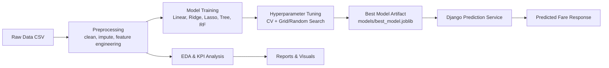

## Plan: Flight Fare ML Pipeline + Django Handoff (DRAFT)

This plan builds a reproducible regression project from scratch using `pip + venv`, with both notebook and modular scripts, and assumes you will place the Kaggle CSV in [data/raw/Flight_Price_Dataset_of_Bangladesh.csv](data/raw/Flight_Price_Dataset_of_Bangladesh.csv). It covers the full rubric: problem framing, cleaning, EDA, baseline + advanced models, tuning, interpretation, and stakeholder reporting. Because the repository is currently empty (besides [LICENSE](LICENSE) and [.gitignore](.gitignore)), the first phase creates project structure and reproducibility artifacts. The final phase adds Django-ready prediction integration (as requested) after core ML is complete, so grading-critical work is finished before app wiring.

**Architecture**
- **Data Layer:** Raw CSV in [data/raw/Flight_Price_Dataset_of_Bangladesh.csv](data\raw\Flight_Price_Dataset_of_Bangladesh.csv), cleaned outputs in [data/processed](data/processed).
- **Pipeline Layer:** Modular scripts in [src](src) for preprocessing, EDA, training, tuning, interpretation, and orchestration.
- **Model Layer:** Serialized best model artifact in [models/best_model.joblib](models/best_model.joblib).
- **Reporting Layer:** KPI tables and plots in [reports](reports) and [reports/figures](reports/figures), with narrative in [notebooks/flight_fare_analysis.ipynb](notebooks/flight_fare_analysis.ipynb).
- **Serving Layer:** Django endpoint in [django_app](django_app) that loads trained artifacts and returns fare predictions.

**Steps**
1. Initialize project scaffolding and reproducibility files: [README.md](README.md), [requirements.txt](requirements.txt), [.gitignore](.gitignore), [data/raw/.gitkeep](data/raw/.gitkeep), [data/processed/.gitkeep](data/processed/.gitkeep), [notebooks/flight_fare_analysis.ipynb](notebooks/flight_fare_analysis.ipynb), [src/config.py](src/config.py), [src/__init__.py](src/__init__.py), [reports/figures/.gitkeep](reports/figures/.gitkeep), [models/.gitkeep](models/.gitkeep).
2. Define constants and schema expectations in [src/config.py](src/config.py): `TARGET_COL`, expected raw columns, date column mapping, categorical/numeric feature groups, train/test split seed, and model metric list.
3. Implement data quality + preprocessing module in [src/data_preprocessing.py](src/data_preprocessing.py) with functions `load_data`, `clean_columns`, `normalize_city_names`, `handle_missing_values`, `fix_invalid_fares`, `engineer_date_features`, `build_total_fare_if_needed`, `prepare_features_target`.
4. Add EDA utilities in [src/eda.py](src/eda.py): `summary_tables`, `kpi_airline_average_fare`, `kpi_popular_routes`, `kpi_top_expensive_routes`, `plot_distributions`, `plot_airline_boxplot`, `plot_monthly_or_seasonal_trends`, `plot_corr_heatmap`; save figures to [reports/figures](reports/figures).
5. Build training/evaluation pipeline in [src/train.py](src/train.py) using sklearn `Pipeline` + `ColumnTransformer` for encoding/scaling and models: Linear, Ridge, Lasso, DecisionTree, RandomForest, optional GradientBoosting; include `evaluate_regression_metrics`.
6. Add tuning module in [src/tune.py](src/tune.py) with `GridSearchCV`/`RandomizedSearchCV` for Ridge/Lasso/Tree/Forest; output comparison table (R², MAE, RMSE, CV mean/std) to [reports/model_comparison.csv](reports/model_comparison.csv).
7. Add interpretation module in [src/interpret.py](src/interpret.py): linear coefficients, tree feature importances, residual diagnostics, and predicted-vs-actual plotting; persist artifacts to [reports/figures](reports/figures).
8. Orchestrate end-to-end run in [src/main.py](src/main.py) with stages `run_eda`, `run_baseline`, `run_model_search`, `run_interpretation`, and save best model using `joblib` to [models/best_model.joblib](models/best_model.joblib).
9. Mirror and explain all steps in notebook narrative at [notebooks/flight_fare_analysis.ipynb](notebooks/flight_fare_analysis.ipynb) for grading readability (problem framing, assumptions, limitations, EDA commentary, model findings, recommendations).
10. Produce concise stakeholder summary in [reports/summary.md](reports/summary.md): key fare drivers, airline/route/season insights, best-model justification, and action recommendations.
11. Add Django integration scaffold in [django_app/](django_app/) after core completion: prediction service loading [models/best_model.joblib](models/best_model.joblib), input validation aligned with preprocessing schema, and one endpoint/view for fare inference.
12. Add lightweight “Airflow-ready” hook scripts in [src/pipeline_tasks.py](src/pipeline_tasks.py) that expose callable functions (`task_preprocess`, `task_train`, `task_evaluate`) for future DAG wiring without introducing Airflow dependency yet.

**Verification**
- Environment: create venv, run `pip install -r requirements.txt`.
- Data checks: run preprocessing entrypoint and confirm cleaned dataset written to [data/processed](data/processed).
- EDA checks: confirm required plots exist in [reports/figures](reports/figures) and KPI tables are produced.
- Modeling checks: run training/tuning; verify comparison table in [reports/model_comparison.csv](reports/model_comparison.csv) and serialized model in [models/best_model.joblib](models/best_model.joblib).
- Interpretation checks: confirm feature-importance/coefficient outputs and residual/actual-vs-predicted charts.
- Django checks: run local server and send one valid prediction payload; verify response and schema handling.

**Decisions**
- Dataset ingestion: manual placement in [data/raw/Flight_Price_Dataset_of_Bangladesh.csv](data/raw/Flight_Price_Dataset_of_Bangladesh.csv).
- Deliverable style: both notebook and modular scripts.
- Environment: `pip + venv` with [requirements.txt](requirements.txt).
- Scope: core ML pipeline plus Django prediction integration; Airflow compatibility via callable task hooks (not full DAG deployment).
