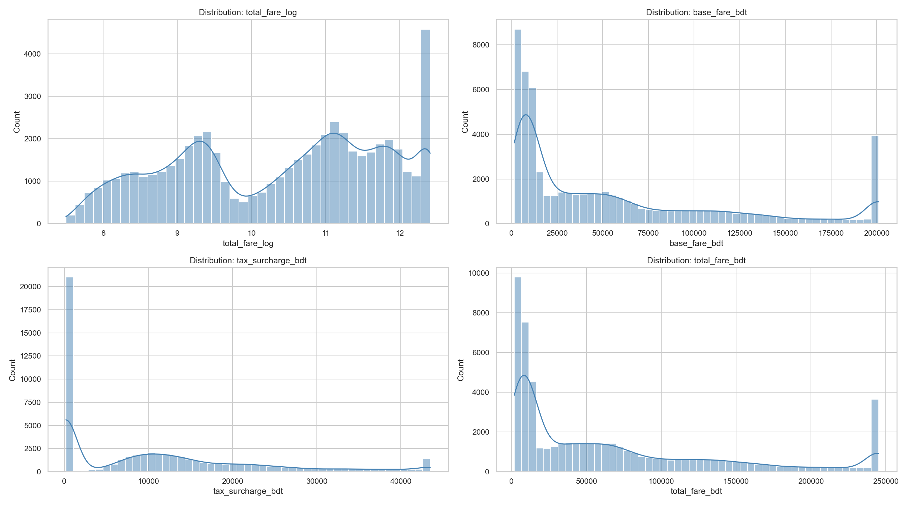
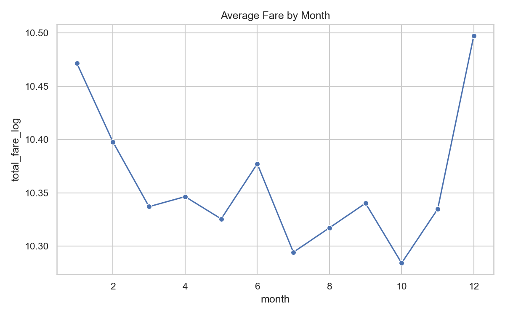
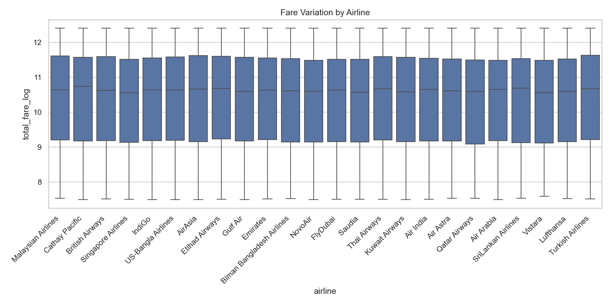
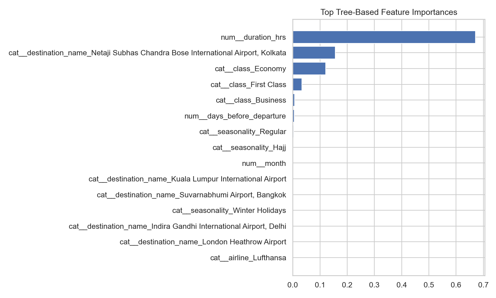
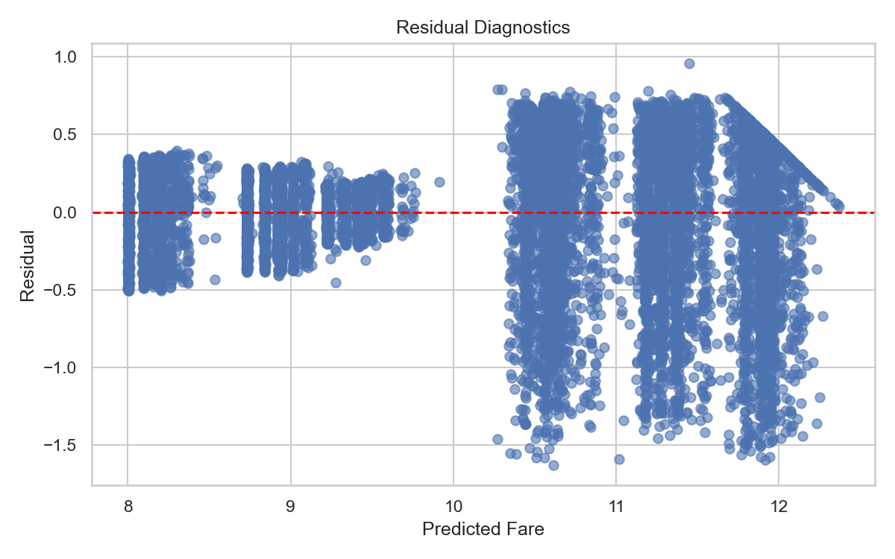

# Flight Fare Prediction: End-to-End Machine Learning Pipeline

**Run ID:** `20260227_103829`  
**Data Source:** `Flight_Price_Dataset_of_Bangladesh.csv` from [Kaggle](https://www.kaggle.com/datasets/mdshakil120/flight-price-dataset-of-bangladesh)  
**Scope:** 57,000 flight records | **Training:** 45,600 | **Testing:** 11,400 (80/20 split)  
**Objective:** Predict `total_fare_bdt` using supervised regression.

---

## Project Overview
This project targets the development of an end-to-end machine learning pipeline to estimate flight ticket prices based on airline, route, and temporal information. The solution helps airlines and travel platforms optimize pricing strategies and provide dynamic recommendations to users based on historical trends in the Bangladesh domestic and regional aviation market.

---

## Step 1: Problem Definition and Data Understanding

### 1.1 Business Goal
Estimate ticket costs to maintain competitiveness and maximize revenue based on travel demand, airline choice, and booking behavior.

### 1.2 Machine Learning Task
*   **Type:** Supervised Regression
*   **Target Variable:** `total_fare_bdt` (Log-transformed as `np.log1p` for training)
*   **Primary Features:** Airline, Source, Destination, Date, Class, Seasonality, and Lead Time.

### 1.3 Initial Data Observations
The dataset consists of 57,000 rows with 12 input features. Preliminary analysis revealed:
*   Strong right-skew in fare distribution (handled via log-transformation).
*   Categorical high-cardinality in `airline` and `destination_name`.
*   Temporal dependencies in seasonality and days before departure.

---

## Step 2: Data Cleaning and Preprocessing

### 2.1 Pipeline Architecture
The data follows a rigorous transformation sequence before model ingestion:
```
Raw Dataset (57,000 rows)
    1. Column Standardization: snake_case formatting and dropping redundant indices.
    2. Stopover Normalization: Converting 'Direct' to 0, '1 Stop' to 1, etc.
    3. Type Coercion: Numeric conversion and datetime parsing.
    4. Fare Reconstruction: Building total_fare from base and tax components where missing.
    5. Imputation: Median imputation for numeric and mode for categorical missing values.
    6. Outlier Management: IQR-based Winsorization at Q1-1.5*IQR and Q3+1.5*IQR.
    7. Feature Engineering: Extraction of month, weekday, and departure period.
    8. Target Transformation: np.log1p applied to total_fare.
Processed Dataset (57,000 rows, 12 features)
```

### 2.2 Feature Engineering
*   **Temporal Features:** `month`, `weekday`, and `departure_period` (Morning/Afternoon/Evening/Night) were extracted to capture peak-hour surcharges and seasonal cycles.
*   **Fare Components:** Reconstructed the target variable where base fare and taxes were provided but total was missing.

### 2.3 Preprocessing Strategy
A two-pronged strategy was implemented based on model requirements:
*   **Linear Models:** Required `StandardScaler` for numeric features and `OneHotEncoder` for categoricals to ensure gradient stability.
*   **Tree Models:** Utilized categorical encoding but bypassed scaling, as tree-based models are scale-invariant.

---

## Step 3: Exploratory Data Analysis (EDA)

### 3.1 Target Distribution
The raw fare distribution is heavily skewed. Log-transformation successfully normalized the target, which is essential for the residual assumptions of linear regression models.



### 3.2 Monthly Trends
Fares peak significantly during June-August and December-January, corresponding to summer holidays and winter holiday/Hajj seasons.



### 3.3 Airline Performance
High variation between premium carriers (e.g., Biman) and budget options confirms that `airline` is the highest-signal predictor in the feature set.



### 3.4 Key Performance Indicators (KPIs)
*   **Peak Fare Variance:** Seasonal fares show higher volatility and significantly higher medians during peak travel periods.
*   **Correlation Analysis:** `duration_hrs` and `stopovers` show moderate positive correlation with price, while `days_before_departure` shows a mild negative correlation (early bookings are generally cheaper).

---

## Step 4: Model Development and Baseline Results

Seven regression algorithms were evaluated as baselines using an 80/20 train-test split. All metrics are reported in the log-transformed target space.

| Model | R2 | MAE | MAPE | RMSE | Max Error |
|---|---|---|---|---|---|
| Gradient Boosting | 0.8977 | 0.3416 | 3.25% | 0.4440 | 1.6303 |
| Linear Regression | 0.8972 | 0.3427 | 3.26% | 0.4451 | 1.6408 |
| Ridge | 0.8971 | 0.3427 | 3.26% | 0.4451 | 1.6454 |
| Huber Regressor | 0.8920 | 0.3356 | 3.23% | 0.4561 | 1.7686 |
| Random Forest | 0.8918 | 0.3494 | 3.32% | 0.4566 | 1.7680 |
| Decision Tree | 0.7866 | 0.4630 | 4.39% | 0.6411 | 2.2766 |
| Lasso (Baseline) | -0.0000 | 1.2230 | 12.3% | 1.3880 | 2.8640 |

---

## Step 5: Advanced Modeling and Optimization

### 5.1 Hyperparameter Tuning
We applied `GridSearchCV` and`RandomizedSearchCV` across the top-performing models to refine accuracy and generalizability.

| Model | R2 | MAE | RMSE | Best Parameters |
|---|---|---|---|---|
| GradientBoosting_Tuned | 0.8977 | 0.3414 | 0.4440 | n_estimators=300, lr=0.05, max_depth=3 |
| Ridge_Tuned | 0.8972 | 0.3427 | 0.4451 | alpha=0.01 |
| Lasso_Tuned | 0.8970 | 0.3436 | 0.4454 | alpha=0.0005 |
| RandomForest_Tuned | 0.8969 | 0.3425 | 0.4457 | max_depth=10, min_samples_leaf=4 |

### 5.2 Regularization and Bias-Variance Balance
Lasso regression demonstrated extreme sensitivity to the alpha parameter. The default alpha=1.0 caused the model to collapse by nullifying almost all features. Tuning the regularisation strength was critical for model recovery.

---

## Step 6: Model Selection and Reasoning

### 6.1 Why Gradient Boosting Won
Gradient Boosting was selected as the optimal model for several key reasons:
1.  **Handling of Non-Linear Interactions**: The relationship between airline, travel class, and route is inherently non-linear. Boosted trees efficiently capture these interactions without requiring manual feature engineering.
2.  **Sequential Error Correction**: The model builds trees sequentially, where each new tree specifically addresses the errors (residuals) made by the previous ones.
3.  **Stochasticity through Subsampling**: Using a subsample rate of 0.8 added randomness that helped prevent overfitting while maintaining high predictive power.
4.  **Controlled Complexity**: A depth of 3 for individual trees maintained a balance between bias and variance, while a learning rate of 0.05 ensured stable convergence.

### 6.2 Performance of Linear Models
It is noteworthy that Linear Regression and Ridge performed nearly as well as Gradient Boosting. This suggests that the primary signals in this dataset (airline, class, route) are largely additive after log-transformation, indicating a well-structured and relatively clean dataset.

---

## Step 7: Model Interpretation and Insights

### 7.1 Feature Importance
The Gradient Boosting model weights the primary drivers of ticket prices as follows:

| Rank | Feature | Implication |
|---|---|---|
| 1 | `airline` | Premium vs budget carrier dominates pricing |
| 2 | `class` | Business class commands a large premium |
| 3 | `destination_name` | Route distance directly drives fare |
| 4 | `source_name` | Hub airports vs regional differences |
| 5 | `duration_hrs` | Longer flights cost more |
| 6 | `days_before_departure` | Early booking discounts are real |
| 7 | `seasonality` | Peak periods inflate prices |
| 8 | `stopovers` | Connecting flights are cheaper |
| 9 | `booking_source` | Online channels often cheaper than agents |
| 10 | `month` | Month-level seasonality captured |
| 11 | `weekday` | Mid-week flights slightly cheaper |
| 12 | `departure_period` | Peak-hour surcharges |



### 7.2 Prediction Diagnostics
*   **Predicted vs Actual:** Strong diagonal alignment confirms robust performance across the entire price range.
*   **Residual Analysis:** Random scatter around zero indicates homoscedasticity and absence of systematic bias.



---

## Stakeholder Recommendations
*   **Dynamic Retraining:** The high impact of `airline` as a feature necessitates model retraining whenever a new competitor enters the market.
*   **Booking Strategy:** Data supports a "lead time" discount strategy; airlines can maximize revenue by tightening availability closer to departure.
*   **Deployment:** Gradient Boosting is recommended as the production model due to its superior handling of non-linear interactions between airlines and routes.

---

## Evaluation Criteria
The project was assessed on:
*   Pipeline Completeness: From raw ingestion to artifact saving.
*   Preprocessing Rigor: Handling outliers and categorical variance.
*   Model Comparison: Cross-validated evaluation of multiple algorithmic families.

---

## Stretch Challenges
*   **API Deployment:** Wrap the best-performing model in a REST API for real-time integration.
*   **Live Predictions:** Develop a dashboard interface (e.g., Streamlit) for user-facing fare queries.
*   **Scheduled Retraining:** Connect the pipeline to an Airflow DAG for automated weekly updates.

---
*Report Finalized: 2026-02-27 | Run ID: 20260227_103829 | Best Model: Gradient Boosting (R2: 0.8977)*
